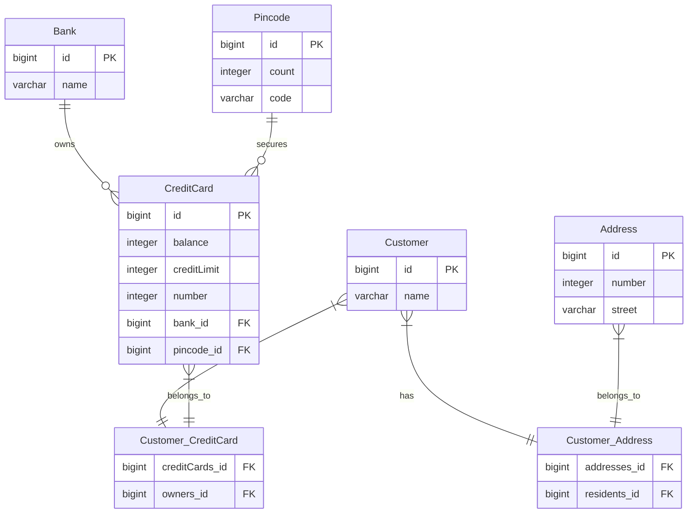

# Answers to the Questions for Experiment 4

## 1. Explain the Used Database and How/When It Runs

The experiment uses an **H2 file-based database**, as specified in the `persistence.xml` file.
The database persists its data to a file (`./DB`), which is configured in the following property:


<property name="hibernate.connection.url" value="jdbc:h2:file:./DB;DB_CLOSE_DELAY=-1"></property> 

H2 Database: H2 is a lightweight, embedded relational database, commonly used for development and testing.
File-Based: The data is saved to a file named ./DB, ensuring persistence between different runs or restarts.
Runs on Demand: Since there is no connected application in this case, the database is initialized when database operations are performed (e.g., through the H2 console or script execution). The schema is created based on the JPA entity mappings.nsures that the database schema (tables and relationships) is created when the application starts. The DB_CLOSE_DELAY=-1 parameter keeps the database connection open until the JVM shuts down.

## 2. Sql Query for creating customer table

```sql

    create table Customer (
        id bigint generated by default as identity,
        name varchar(255),
        primary key (id)
    )

```

## 3. 


Yes, the created tables correspond to the initial thoughts regarding the exercise. The generated schema reflects the expected relationships between entities, as outlined in the domain model:

- **Many-to-Many Relationships** between `Customer` and `Address`, and `Customer` and `CreditCard`, are correctly represented by the join tables `Customer_Address` and `Customer_CreditCard`.
- **Many-to-One Relationships** between `CreditCard` and `Bank`, and `CreditCard` and `Pincode`, are captured through foreign key constraints (`bank_id`, `pincode_id`).
  
The diagram provides a clear depiction of these relationships, confirming that the database schema aligns with the original design.

# DAT250 Experiment 4 Hand-in

## Technical Problems Encountered

During the implementation of Experiment 2, I encountered several technical problems while using Java Persistence Architecture (JPA):

1. **Set vs. Collection Issue**:
   One of the major issues was making the test case involving `Set.of(customer)` pass. Initially, I had implemented the `getOwners()` method to return a `Collection`, which caused the test to fail because the test expected a `Set` (specifically, a Hibernate-managed collection like `PersistentBag`). I resolved this issue by ensuring that the bidirectional relationship was properly maintained, and I allowed Hibernate to manage the collection without converting it into a `Set`. This allowed the test case to pass as expected.

2. **Bidirectional Relationship Management**:
   Ensuring that both sides of the relationships between entities were properly maintained (such as between `Customer` and `Address`, or `Customer` and `CreditCard`) was another issue I faced. I had to carefully synchronize the relationships so that both entities were aware of each other and Hibernate could manage the relationships correctly. For example, when a `Customer` was added to an `Address`, I had to make sure that the `Address` was also added to the `Customer`.

3. **Database Schema Inspection**:
   Inspecting the database schema and confirming that the correct tables were created was another challenge. I used Hibernate's SQL logging and the H2 console to inspect the tables and ensure they matched the expected schema. By enabling Hibernate SQL logging in `persistence.xml`, I was able to see the SQL commands generated by Hibernate, which confirmed that the tables were created correctly.

## Code Link

The complete code for Experiment 2, including the test case, is available at the following link:

[Experiment 4 Code on GitHub](https://github.com/SindreEieLedsaak/dat250-jpa-tutorial/tree/master)

The included test case now passes successfully after resolving the issues mentioned above.

## Database Inspection

To inspect the database tables, I used Hibernate SQL logging and the H2 console. Here is the SQL output for table creation:

```sql
Hibernate: create table Customer (
    id bigint generated by default as identity,
    name varchar(255),
    primary key (id)
);
Hibernate: create table CreditCard (
    balance integer,
    creditLimit integer,
    number integer,
    bank_id bigint,
    id bigint generated by default as identity,
    pincode_id bigint,
    primary key (id)
);
Hibernate: create table Address (
    number integer,
    id bigint generated by default as identity,
    street varchar(255),
    primary key (id)
);
Hibernate: create table Pincode (
    count integer,
    id bigint generated by default as identity,
    code varchar(255),
    primary key (id)
);
```
This SQL output confirms that the Customer, CreditCard, Address, and Pincode tables were created as expected, along with their relationships.

I also used the H2 console to visually inspect the tables and ensure that the relationships between entities, such as many-to-many between Customer and Address, were reflected in the schema.

Pending Issues
At the time of submission, I do not have any unresolved issues with this assignment. The test cases pass, and the database schema matches the expected design. However, it took some time to resolve the Set.of issue, which was challenging due to Hibernate's management of collections.
